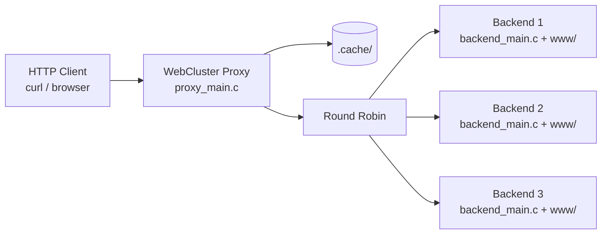

# WebCluster

WebCluster is a C-based HTTP/1.1 networking project that can run as either a reverse proxy or a backend server. The project implements a reverse proxy with Round Robin load balancing, persistent disk cache with TTL, concurrent client handling using POSIX threads, TCP socket communication, and backend server execution using the same codebase.

The current architecture uses `main.c` as a startup menu. From this menu, the user can choose whether the program runs in proxy mode or backend mode.

---

## Main features

- Role-selection menu from `main.c`.
- Reverse proxy execution through `proxy_main.c`.
- Backend server execution through `backend_main.c`.
- HTTP/1.1 request parsing.
- Support for HTTP methods such as `GET`, `HEAD`, `POST`, `PUT`, `DELETE`, `OPTIONS`, `TRACE`, and `CONNECT`.
- Round Robin load balancing across configured backend servers.
- Persistent disk cache with TTL.
- Cache cleaner thread for expired entries.
- Concurrent client handling with POSIX threads.
- TCP socket communication.
- External configuration using `pibl.conf`.
- Logging through `pibl.log`.

---

## Architecture summary



The proxy and the backends can run locally on the same machine for testing, or they can be deployed on different servers.

Important deployment rule:

- A proxy-only server does not require the `www/` folder.
- Backend servers require `www/` because it is their document root.
- The proxy requires `pibl.conf`, `.cache/`, and access to backend IP addresses.

---

## Project structure

```text
WebCluster/
├── main.c
├── proxy_main.c
├── backend_main.c
├── main_http.c
├── makefile
├── pibl.conf
├── pibl.log
├── Configuration/
│   ├── config.c
│   └── config.h
├── ManageClient/
│   ├── manage_client.c
│   ├── manage_client.h
│   ├── manage_client_utils.c
│   ├── manage_client_utils.h
│   └── thread_args.h
├── src/
│   ├── Network/
│   ├── Proxy/
│   ├── HTTP/
│   └── cache/
├── www/
└── .cache/
```

---

## Main files

| File or folder | Purpose |
|---|---|
| `main.c` | Displays the startup menu and lets the user choose proxy or backend mode. |
| `proxy_main.c` | Starts the reverse proxy, load balancer, cache, logger, and client-accept loop. |
| `backend_main.c` | Starts an HTTP backend server and serves resources from `www/`. |
| `Configuration/` | Loads proxy configuration from `pibl.conf`. |
| `ManageClient/` | Handles each connected client in proxy mode. |
| `src/Network/` | Contains TCP socket utilities. |
| `src/Proxy/` | Contains cluster, Round Robin, and logging logic. |
| `src/HTTP/` | Contains HTTP parsing, request/response structures, and method logic. |
| `src/cache/` | Contains persistent cache logic. |
| `www/` | Backend document root. Not required for a proxy-only deployment. |
| `.cache/` | Proxy cache directory. |

---

## Requirements

- GCC.
- Make.
- POSIX-compatible environment, preferably Linux or WSL.
- `pthread` support.
- `curl` for testing.

---

## Compilation

From the project root:

```bash
make
```

To clean compiled files:

```bash
make clean
```

---

## Configuration

The proxy reads its configuration from `pibl.conf`.

Example:

```conf
PORT=8080
CACHE_TTL=60
BACKEND=127.0.0.1:5001
BACKEND=127.0.0.1:5002
BACKEND=127.0.0.1:5003
```

| Parameter | Meaning |
|---|---|
| `PORT` | Port where the proxy listens. |
| `CACHE_TTL` | Lifetime of cached responses in seconds. |
| `BACKEND` | IP address and port of each backend server. |

---

## Running the project

### Option 1: Run through the main menu

Run the executable generated by the project. If the current target is named `servidor`, use:

```bash
./servidor
```

Then choose the execution mode from the menu:

```text
1. Run as proxy
2. Run as backend
```

### Option 2: Run backend targets directly, if available

For local tests, start three backend servers:

```bash
./backend 5001 ./www backend1
./backend 5002 ./www backend2
./backend 5003 ./www backend3
```

Then start the proxy through the main menu or the proxy executable target defined in the `makefile`.

---

## Local test flow

A common local test setup is:

1. Compile the project with `make`.
2. Start backend 1 on port `5001`.
3. Start backend 2 on port `5002`.
4. Start backend 3 on port `5003`.
5. Start the proxy on port `8080`.
6. Send HTTP requests to the proxy using `curl`.

---

## Test commands

GET request:

```bash
curl.exe -v http://127.0.0.1:8080/index.html
```

HEAD request:

```bash
curl.exe -I http://127.0.0.1:8080/index.html
```

OPTIONS answered locally by the proxy:

```bash
curl.exe -v -X OPTIONS http://127.0.0.1:8080/index.html -H "Max-Forwards: 0"
```

OPTIONS forwarded to backend:

```bash
curl.exe -v -X OPTIONS http://127.0.0.1:8080/index.html -H "Max-Forwards: 1"
```

PUT request:

```bash
curl.exe -v -X PUT http://127.0.0.1:8080/test.txt -H "Content-Type: text/plain" --data "New content"
```

DELETE request:

```bash
curl.exe -v -X DELETE http://127.0.0.1:8080/test.txt
```

TRACE request:

```bash
curl.exe -v -X TRACE http://127.0.0.1:8080/index.html
```

CONNECT request example:

```bash
curl.exe -v -x http://127.0.0.1:8080 https://example.com/
```

---

## Cache behavior

The proxy cache stores HTTP responses in `.cache/` and registers entries in `.cache/cache_index.txt`.

Cache key format:

```text
METHOD|HOST|URI
```

Index format:

```text
expires_at|file_path|cache_key
```

Simplified cache rules:

- `GET` and `HEAD` can be cached.
- Requests with `Authorization` are not cached.
- Requests with `Cookie` are not cached.
- Requests with `Cache-Control: no-store` are not cached.
- Requests with `Cache-Control: private` are not cached.
- Requests with `Cache-Control: max-age=0` are not cached.

---

## Deployment notes

### Proxy-only server

A proxy-only deployment should contain:

```text
proxy executable / main executable
pibl.conf
pibl.log
.cache/
```

It does not require:

```text
www/
```

### Backend-only server

A backend-only deployment should contain:

```text
backend executable / main executable
www/
```

It does not require proxy cache files unless the same machine will also run proxy mode.

---

## Documentation

The full technical documentation is available in the project Wiki. It includes:

- General architecture.
- Startup role selection.
- Proxy and backend modules.
- Request flows.
- Cache behavior.
- Round Robin load balancing.
- CONNECT tunnel sequence.
- OPTIONS with Max-Forwards sequence.
- Deployment diagrams.
- Data structures.
- Naming conventions and programming style.
- Functional test plan.

---
# WebCluster

## Programming style

The project follows a procedural and modular C style:

- `main.c` is used for role selection.
- `proxy_main.c` contains proxy startup logic.
- `backend_main.c` contains backend startup logic.
- Modules expose interfaces through `.h` files.
- Implementations are located in `.c` files.
- Functions generally use `snake_case`.
- Custom typedef types use the `_t` suffix.
- Constants and macros use uppercase names.
- Shared resources are protected with mutexes when required.

---

## References

- [RFC 9110 - HTTP Semantics](https://www.rfc-editor.org/rfc/rfc9110.html)
- [RFC 9111 - HTTP Caching](https://www.rfc-editor.org/rfc/rfc9111.html)
- [RFC 9112 - HTTP/1.1](https://www.rfc-editor.org/rfc/rfc9112.html)
- [Beej's Guide to Network Programming](https://beej.us/guide/bgnet/)
- [Linux socket manual](https://man7.org/linux/man-pages/man2/socket.2.html)

